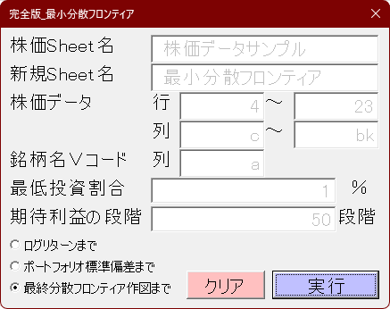
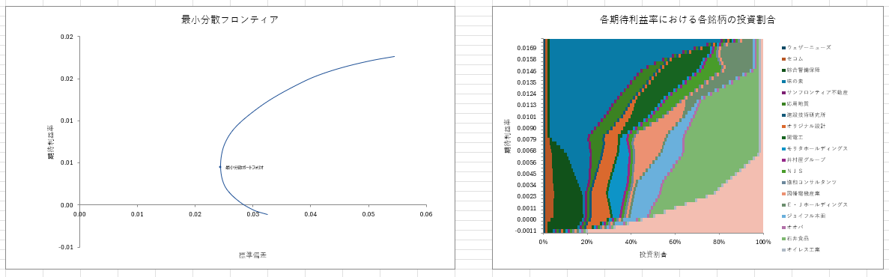

# Excel_VBA_MinimumVariancePortfolio
Minimum Variance Portfolio

## 概要
Excel上で株価データから最小分散フロンティアを作図します。  
ExcelのSolverアドインを使用します。

## 動作環境
Microsoft Excel上で動作します。  

## インストール方法
1. Contentsフォルダ内の frmMVP.frm、frmMVP.frx を任意の同一フォルダに保存
2. 任意のExcelBookをマクロ有効ブック(.xlsm)として保存
3. [ファイル]>[オプション]>[アドイン]>[設定]でソルバー アドインにチェックを入れて[OK]またはEnter
4. [開発タブ]またはAlt+F11でVisual Basicを開く
5. [ツール]>[参照設定]またはAlt+T+RからSlverにチェックを入れて[OK]またはEnter
6. [▶Sub/ユーザー フォームの実行]またはF5でユーザーフォームを実行

## 機能
選択範囲について以下の機能を実行

* 変換方向の選択  
  全角→半角 または 半角→全角  

* 変換対象の選択  
  * 英数字  
  * 記号    
  * カタカナ  
  * スペース  

* 数式が入力されたセルに対する処理の選択  

## 連絡先
[Instagram](https://www.instagram.com/nattotoasto?igsh=NWNtdHhnY3A4NDQ0 "nattotoasto")

## ライセンス
MIT License
